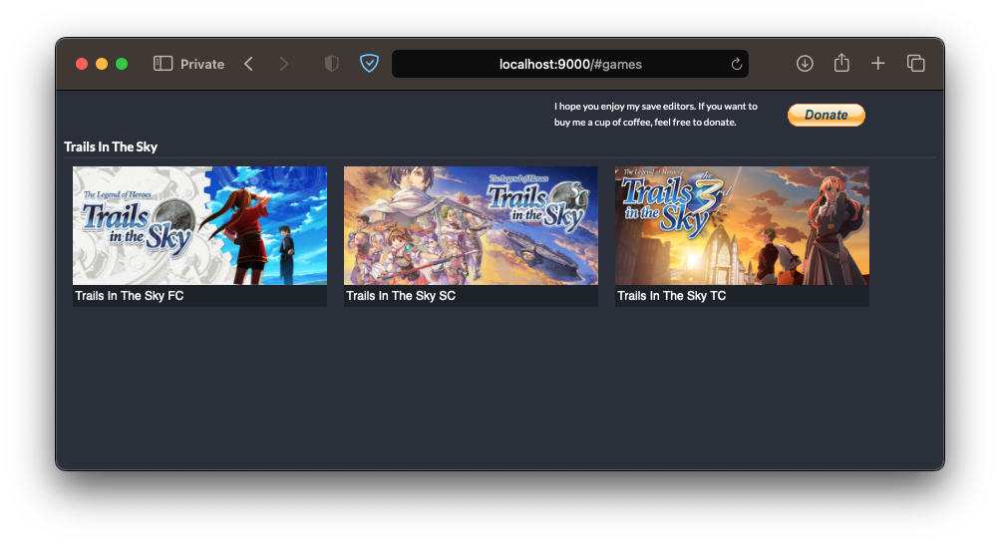

# GameSaveEditor



## Concept

This app is a generic JavaScript platform to aid in development of client-side save editors. Currently supported natively:
- The Legend of Heroes: Trails in The Sky FC
- The Legend of Heroes: Trails in The Sky SC
- The Legend of Heroes: Trails in The Sky TC

## Changes

This fork contains some bugfixes and make it compatible with non-Chromium-based browsers.

## Host it locally

We can host this app locally, but we have to use a local web server.
The following instruction is tested on:
- SteamOS 3.4.6 (on Steam Deck) using Mozilla Firefox
- macOS Ventura (on iMac) using Safari and Google Chrome

### Requirements

Make sure that you have the following installed on your system:

- Python 3

### Usage

1. Backup your save file.
2. Either download this repository as ZIP file or clone this repository.
3. Assuming you downloaded or cloned the repository on `~/Downloads/GameSaveEditor`, open a terminal or console app and type the following command:
```
cd ~/Downloads/GameSaveEditor/public
```
4. Afterwards, type the following command to run a local web server on port 9000 with Python 3:
```
python3 -m http.server 9000
```
5. Congratulations! You have sucessfully hosted the `GameSaveEditor` app on your local.
6. Open your browser, and type this URL: `http://localhost:9000`
7. Click on the game that you want to edit the save file and load up your save file.
8. Edit various parameters on your save file, then click `Save` on the left sidebar to download the edited save file.
9. Rename the downloaded file (something like: `SVDAT001.SAV`) and replace the original save file.
10. Enjoy! 

## Credits

Original repo: https://github.com/Stormwave/SaveEditor

Original hosted version: https://save-editor.stormwave.uk